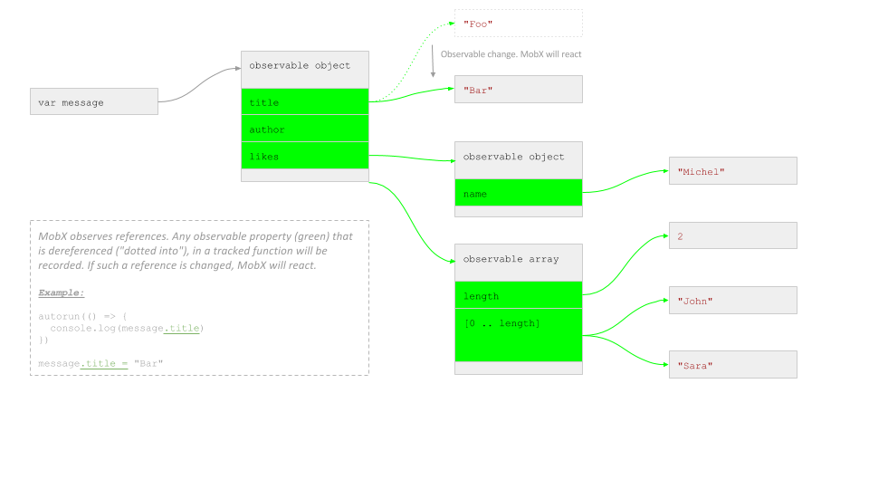

# 什么情况下Mobx才会响应（react）？

（之所以先翻译这个，是因为暂时需要先了解这些坑）

Mobx通常会像你所想的那样响应，可以说90%的情况下你所使用的mobx都可以顺利工作。
然而，在一些情况下你回到遇到不符合你期望的案例，在那种情况下，值得深入理解Mobx是如何检测它需要如何响应。

>在可追踪函数执行过程中，如果任一 **已被观察** 的_属性（property）_被**使用（read）**时，这个被观察的属性会触发响应_

> MobX reacts to any _existing_ **observable** _property_ that is read during the execution of a tracked function.

* _"使用"_ 是对对象属性的解引用。可以通过点引用的方式（如 `user.name`）或者中括号的使用方式（如 `user['name']`）
* _"可追踪的函数"_ 是对一些函数的表述：如`computed`；如一个观察者组件的renderf方法；或者是传给`when`, `reaction` 和 `autorun` 三个函数的第一个参数
* _"在XX的执行过程中"_ 意味着被观察对象只有在函数的执行过程中被使用。至于直接使用或是间接使用，都不是问题。

换句话说，以下情况Mobx不会响应：
* 值虽然是通过被观察者获取的，这一过程却不在追踪函数中。
* 被观察者在一个异步的代码段中被使用


## Mobx追踪的是属性，而不是属性对应的值

为了更加清晰地用例子阐明上述规则，假设你有如下一个可观察的数据结构（可观察作用于一个对象时默认是递归的，所以这个例子中的所有字段都是可观察的）

```javascript
let message = observable({
    title: "Foo",
    author: {
        name: "Michel"
    },
    likes: [
        "John", "Sara"
    ]
})
```

在内存中这个过程看起来如下图，绿方块代表可观察的属性。注意值本身不是可观察的




## 例子

让我们来看看一些例子（基于上述定义的 `message`变量）

#### 正确: 在被追踪函数中解引用

```javascript
autorun(() => {
    console.log(message.title)
})
message.title = "Bar"
```

这会像预期的那样进行响应，`.title` 在autorun中被解引用。然后在后续被改变，所以这个改变是可以被检测到的。
This will react as expected, the `.title` property was dereferenced by the autorun, and changed afterwards, so this change is detected.

你可以验证Mobx会通过在被追踪函数内部调用 `whyRun()`函数进行追踪，在这个例子中该函数会输出如下

```javascript
autorun(() => {
    console.log(message.title)
    whyRun()
})

// Outputs:
WhyRun? reaction 'Autorun@1':
 * Status: [running]
 * This reaction will re-run if any of the following observables changes:
    ObservableObject@1.title
```

#### 不正确: 改变一个不是可观察的引用

```javascript
autorun(() => {
    console.log(message.title)
})
message = observable({ title: "Bar" })
```

这**不会**响应，`message`改变了，但 `message` 并不是可观察的，只是一个引用，指向一个可观察的对象，但这个引用本身不是可观察的。

（译者按：这是说，改变message中如title之类的属性，是会响应的，但重新给message赋一个新对象，则不会进行响应）


#### 不正确：在被追踪函数之外解引用

```javascript
var title = message.title;
autorun(() => {
    console.log(title)
})
message.title = "Bar"
```

这**不会**响应，`message.title` 在 `autorun` 之外被解引用了，而被传进来的只是 `message.title` 的值，`title`本身不是可观察的，所以 `autorun` 不会响应

#### 正确: 在被追踪函数之内解引用

```javascript
autorun(() => {
    console.log(message.author.name)
})
message.author.name = "Sara";
message.author = { name: "John" };
```

两次改变都会正常响应。`author` 和 `author.name` 都用的是点调用的方式，允许Mobx去追踪它们的引用。

#### 不正确: 将可观察的对象通过新生命变量进行引用，将不会有追踪 

```javascript
const author = message.author;
autorun(() => {
    console.log(author.name)
})
message.author.name = "Sara";
message.author = { name: "John" };
```

第一个改变会发生，`message.author` 和 `author` 指向同一个对象，并且`.name` 是在autorun中解引用
但第二个改变不会发生，`message.author`这个关系在 `autorun` 没被追踪，Autorun始终使用的是『旧』的 `author`

#### 正确: 在追踪函数中调用数组的属性

```javascript
autorun(() => {
    console.log(message.likes.length);
})
message.likes.push("Jennifer");
```

这会如预期一样响应。`.length` 计数是一个属性，注意会对array中的每一个变化进行响应。Array不是通过其中的每一个元素或属性进行追踪，可是整体追踪。

This will react as expected. `.length` counts towards a property.
Note that this will react to *any* change in the array.
Arrays are not tracked per index / property (like observable objects and maps) but as a whole.

#### 不正确: 在追踪函数中调用越界索引

```javascript
autorun(() => {
    console.log(message.likes[0]);
})
message.likes.push("Jennifer");
```

如果用的是之前的数据，上述这个例子会响应，数组索引（index）被作为属性一样调用，但是只在 `index < length` 的情况下才会生效。
Mobx 不会追踪一个还不存在的属性（除非使用maps），所以确保你使用的数组引用小于该数组的长度。 

#### 正确: 在追踪函数中调用数组相关函数

```javascript
autorun(() => {
    console.log(message.likes.join(", "));
})
message.likes.push("Jennifer");
```

这会如预期一样响应。所有不会改变数组的数组相关函数都会被自动追踪

---

```javascript
autorun(() => {
    console.log(message.likes.join(", "));
})
message.likes[2] = "Jennifer";
```

这会如预期一样响应。所有的数组索引都会被检测，但只在 `index < length`的情况下
This will react as expected. All array index assignments are detected, but only if `index <= length`.

#### 不正确: "使用" 一个可观察对象，但并不调用任何它的属性

```javascript
autorun(() => {
    message.likes;
})
message.likes.push("Jennifer");
```

这不会响应。因为`likes` 这个数组本身并没有被`autorun` 使用，只是放了个引用在这里。
对照来看，写成`messages.likes = ["Jennifer"]` 这样就会响应，因为改变的不是数组的内容，而是`likes`属性本身

#### 不正确: 使用未被观察的对象属性


```javascript
autorun(() => {
    console.log(message.postDate)
})
message.postDate = new Date()
```

这不会响应。Mobx只追踪可观察属性

#### 不正确: 使用可观察对象中不存在的属性
#### Incorrect: using not yet existing observable object properties

```javascript
autorun(() => {
    console.log(message.postDate)
})
extendObservable(message, {
    postDate: new Date()
})
```

这也不会响应。因为当追踪开始时，被追踪的属性还不存在。
但如果是其他可观察对象触发这个`autorun` 重新执行（re-run），则 `autorun` 会重新开始很好地追踪 `postDate` 属性。

#### 正确: 使用不存在的Map字段（entry）

```javascript
const twitterUrls = observable(asMap({
    "John": "twitter.com/johnny"
}))

autorun(() => {
    console.log(twitterUrls.get("Sara"))
})
twitterUrls.set("Sara", "twitter.com/horsejs")
```

这会响应，因为可观察Map支持观察不存在的字段。
注意一开始会打印出 `undefined`
你可以使用 `twitterUrls.has("Sara")` 先确认字段的存在。所以如果需要使用一个动态的字段集合，建议使用可观察Map
This **will** react. Observable maps support observing entries that may not exist.
Note that this will initially print `undefined`.
You can check for the existence of an entry first by using `twitterUrls.has("Sara")`.
So for dynamically keyed collections, always use observable maps.


## MobX 只追踪同步调用的数据

```javascript
function upperCaseAuthorName(author) {
    const baseName = author.name;
    return baseName.toUpperCase();
}
autorun(() => {
    console.log(upperCaseAuthorName(message.author))
})
message.author.name = "Chesterton"
```

这会如预期一样响应。即使 `author.name` 并没有在 `autorun` 中解引用。
Mobx始终会追踪`upperCaseAuthorName` 中发生的一切解引用，因为这一切都是在autorun的**执行过程中**发生。

----

```javascript
autorun(() => {
    setTimeout(
        () => console.log(message.likes.join(", ")),
        10
    )
})
message.likes.push("Jennifer");
```

这不会响应。因为在 `autorun` 的执行过程中没有可观察者被使用，而是在 `setTimeout` 中使用。
值得警告的是，传递一个渲染回调函数给React组件的情况下，如下面这个例子：

```javascript
const MyComponent = observer(({ message }) =>
    <SomeContainer
        title = {() => <div>{message.title}</div>}
    />
)

message.title = "Bar"
```
初步看起来好像没什么问题，除了`<div>`没有通过`MyComponent`实际渲染出来（`MyComponent`的渲染过程是已经被追踪的），而是通过`SomeContainer` 来渲染 。所以确保`SomeContainer`的title正确地响应了一个`message.title`的新值，`SomeContainer`也被当做了一个`observer`。如果`SomeContainer`来源于一个外部库，你可以通过在自己的无状态`observer`组件内包裹一层`div`，并且在回调中实例化来修正这个问题。如以下示例：

```javascript
const MyComponent = observer(({ message }) =>
    <SomeContainer
        title = {() => <TitleRenderer message={message} />}
    />
)

const TitleRenderer = observer(({ message }) =>
    <div>{message.title}</div>}
)

message.title = "Bar"
```

## 避免将可观察者缓存在本地变量中

一个常见的错误是将引用的可观察者缓存在本地变量中。例如：

```javascript
@observer class MyComponent extends React.component {
    author;
    constructor(props) {
        super(props)
        this.author = props.message.author;
    }

    render() {
        return <div>{author.name}</div>
    }
}
```

当改变`author` 的`name`时，这个组件的确会正确地响应，但改变`author`自身的时候，则不会正确地响应。因为解引用发生在`render()` 这个`observer`组件唯一的追踪方法之外。
注意即使你将组件自身的`author` 设置为 `@observable`，也不能解决这个问题，因为这个属性只被初始化了一次。
可以通过简单地解决这个问题：将解引用放在`render()`内；或者引入一个计算值


```javascript
@observer class MyComponent extends React.component {
    @computed get author() {
        return this.props.message.author
    }
```

## 当多组件的情况下会如何渲染

假设我们使用如下组件，以渲染我们的 `message`对象

```javascript
const Message = observer(({ message }) =>
    <div>
        {message.title}
        <Author author={ message.author } />
        <Likes likes={ message.likes } />
    </div>
)

const Author = observer(({ author }) =>
    <span>{author.name}</span>
)

const Likes = observer(({ likes }) =>
    <ul>
        {likes.map(like =>
            <li>{like}</li>
        )}
    </ul>
)
```

| 变化 | 重渲染的组件 |
| --- | --- |
| `message.title = "Bar"` | `Message` |
| `message.author.name = "Susan"` | `Author` (`.author` is dereferenced in `Message`, but didn't change)* |
| `message.author = { name: "Susan"}` | `Message`, `Author` |
| `message.likes[0] = "Michel"` | `Likes` |


注意：
1. \* 如果`Author`组件被唤起时使用的是`<Author author={ message.author.name} />` 这样的方式。则`Message`会成为解引用组件，并响应`message.author.name`的变化。
尽管如此，`<Author>` 仍然会正常地渲染，因为它接受了一个新值。但为了性能的考虑，我们应该尽可能晚地解引用。
2、 \** 如果 likes不是一个字符串而是一个对象，并且他们被自己的`Like`组件所渲染，则其中具体的某个like发生改变时，`Likes`不会触发重渲染。


## 总而言之（TL;DR）

>在可追踪函数执行过程中，如果任一 **已被观察** 的_属性（property）_被**使用（read）**时，这个被观察的属性会触发响应_
> MobX reacts to any an _existing_ **observable** _property_ that is read during the execution of a tracked function.