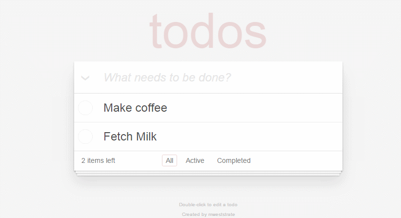

# MobX + React DevTools

Mobx 附带的 DevTools 可以用来追踪你应用的渲染行为与数据依赖。



## 使用:

安装:

`npm install mobx-react-devtools`

在你代码库的某个地方，导入与渲染 devtools，来启用它。

```JS
import DevTools from 'mobx-react-devtools'

const App = () => (
  <div>
    ...
    <DevTools />
  </div>
)
```

对于更多的细节，请查看 [mobx-react-devtools](https://github.com/mobxjs/mobx-react-devtools) 仓库。
