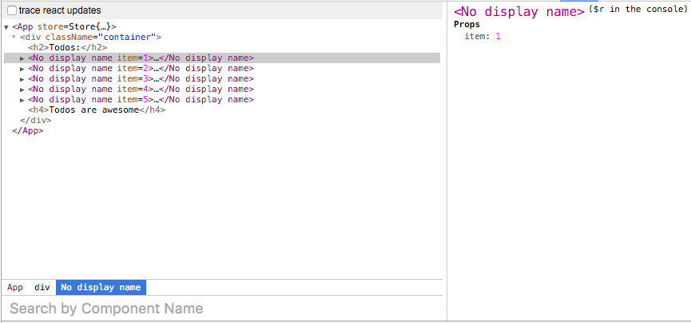
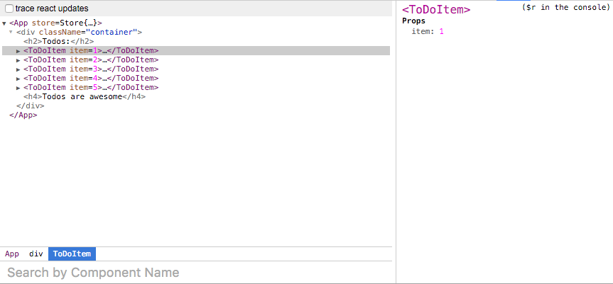

# 无状态组件的热加载

当我们刚开始使用 MobX（与普通 React）有一件事情会是一个挑战，怎样去理解热加载（HMR）有时会失败。当你初始化使其工作时，它看起来十分魔幻（确实如此），然而至少有一个关于 HMR 与 React 的模糊边缘：无状态组件。无状态组件不会显示得将它们定义为 React 组件，HMR 不知道该如何对待它们，因此在你的 console 里会看到警告类似于这样：

```
[HMR] The following modules couldn't be hot updated: (Full reload needed)
This is usually because the modules which have changed (and their parents) do not know how to hot reload themselves. See http://webpack.github.io/docs/hot-module-replacement-with-webpack.html for more details.
[HMR]  - ./src/ToDoItem.jsx
```

当你开始使用 MobX 时这点尤为明显，因为 observable 使得创建大量的无状态组件变得更加容易。这里有些建议，如何构建你的无状态组件，让它仍能享受到 HMR 带来的便利：

## 使用函数声明来代替箭头函数

函数声明与箭头函数是做一样事情的，但在 React DevTools 中函数命名具有实际命名的优势。

例如，这是一个使用箭头函数构建的无状态组件：

```javascript
const ToDoItem = observer(props => <div>{props.item}</div>);

export default ToDoItem;
```

在 React DevTools 中将这样显示：



另一方面，使用函数声明将允许你构建相同的无状态组件，它将在 DevTools 中显示：

```javascript
function ToDoItem(props) {
  return <div>{props.item}</div>
}

export default observer(ToDoItem);

```

现在组件正确地显示在 DevTools 中：



## 确保你的顶层组件是有状态的观察者

"有状态的观察者"，我的意思是指一个通过 `React.Component` 或 `React.createClass` 创建的组件，并使用 `@observer` 装饰器，就像：

```javascript
import { observer } from 'mobx-react';

@observer
class App extends React.Component {
  constructor(props) {
    super(props);
    this.store = props.store;
  }

  render() {
    return (
      <div className="container">
        <h2>Todos:</h2>
        {
          this.store.todos.map((t, idx) => <ToDoItem key={idx} item={t}/>)
        }
      </div>
    );
  }
}
```

在上述例子中，`ToDoItem` 是无状态的，但是仍能与 HMR 一起工作，是因为 UI 树的顶层组件是有状态的观察者。因此，无论何时我们改变 **任何** 无状态组件，都将被热加载，因为在顶层组件中的观察者将会触发计算。由于顶层组件是一个很好的老式 React 组件，它将为它所有的子组件触发 HMR。所有无状态的组件，observable 以及热加载都魔法般完美组合在了一起。